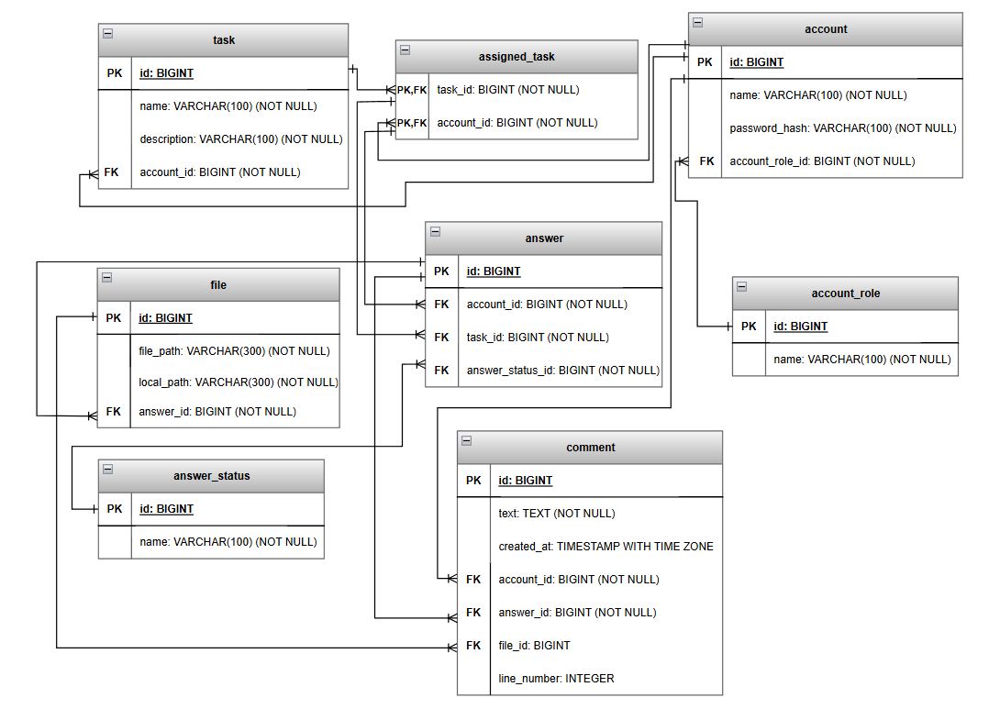

## Схема БД

### account — пользователи
* id — идентификатор пользователя (primary key)
* name — имя пользователя
* password — пароль в хэшированном формате
* account_role_id — id роли (foreign key → account_role)

### account_role — роли пользователей
* id — идентификатор пользователя (primary key)
* name — название роли (STUDENT, TEACHER)

### answer_status — статус ответа на задание
* id — идентификатор статуса (primary key)
* name — название статуса

### file — хранилище файлов, присланные в виде ответа на задание
* id — идентификатор файла (primary key)
* file_path — строка, описывающая изначальный путь к файлу
* local_path - строка, описывающая путь к файлу на сервере
* answer_id — id ответа (foreign key → answer)

### task — задача (формируется преподавателем)
* id — идентификатор задачи (primary key)
* name — название задачи
* description — описание задачи
* account_id — id пользователя (foreign key → account)

### answer — ответ на задание (присылает студент)
* id — идентификатор ответа (primary key)
* account_id — id пользователя (foreign key → account)
* task_id — id задачи (foreign key → task)
* answer_status_id — id статуса ответа (foreign key → answer_status)

### assigned_task — назначенное задание (назначает преподаватель)
* id — идентификатор назначенного задания (primary key)
* account_id — id пользователя (foreign key → account)
* task_id — id задачи (foreign key → task)
* answer_status_id — id статуса ответа (foreign key → answer_status)

### comment — комментарий на ответ
* id — идентификатор комментария (primary key)
* text — комментарий
* created_at — время создания
* account_id — id пользователя (foreign key → account)
* answer_id — id ответа (foreign key → answer)
* file_id — id файла (foreign key → file)
* line_number — номер строки в файле